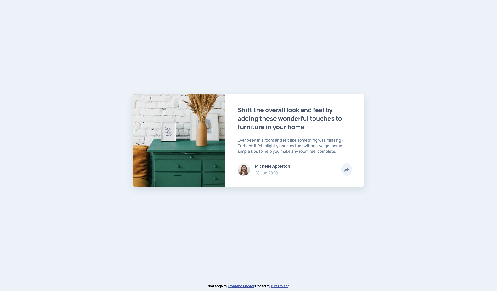
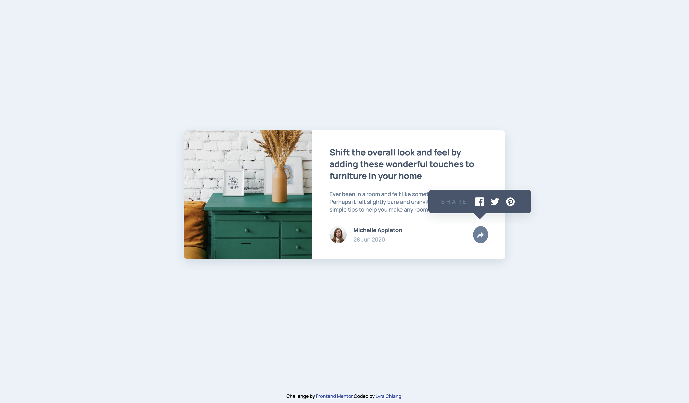
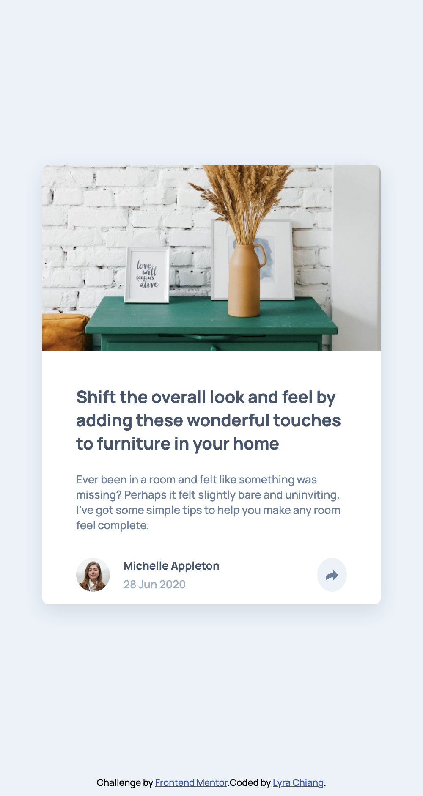
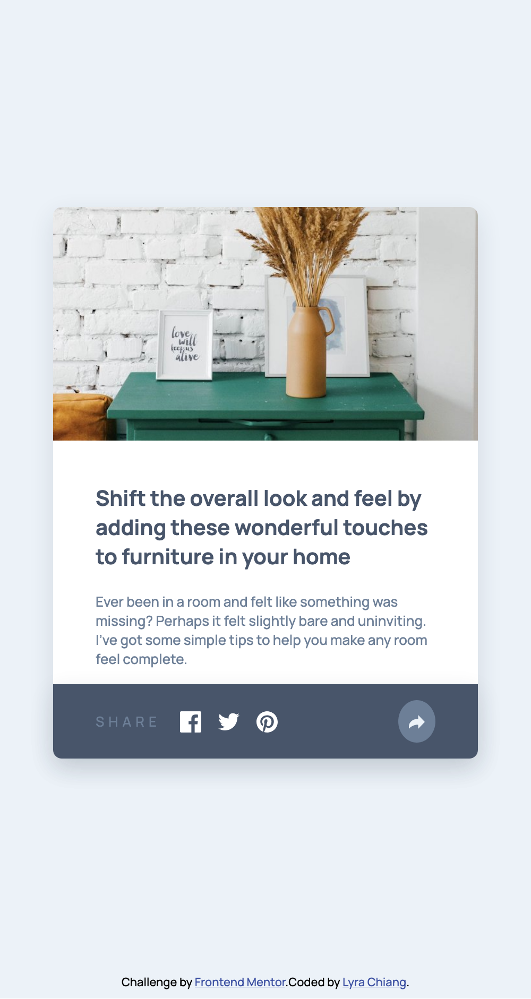

# Frontend Mentor - Article preview component solution

This is a solution to the [Article preview component challenge on Frontend Mentor](https://www.frontendmentor.io/challenges/article-preview-component-dYBN_pYFT). Frontend Mentor challenges help you improve your coding skills by building realistic projects. 

## Table of contents

- [Overview](#overview)
  - [The challenge](#the-challenge)
  - [Screenshot](#screenshot)
  - [Links](#links)
- [My process](#my-process)
  - [Built with](#built-with)
- [Author](#author)
- [Acknowledgments](#acknowledgments)

## Overview

### The challenge

Users should be able to:

- View the optimal layout for the component depending on their device's screen size
- See the social media share links when they click the share icon

### Screenshot

- Desktop

- Mobile

### Links

- Solution URL: [Solution](https://github.com/lyrachiang/frontend-mentor-challenges/tree/main/07-article-preview-component)
- Live Site URL: [Solution Demo](https://lyrachiang.github.io/frontend-mentor-challenges/07-article-preview-component/)

## My process

### Built with

- Semantic HTML5 markup
- CSS custom properties
- SCSS Modules
- Flexbox
- React
- Vite
- TypeScript

## Author

- Frontend Mentor - [@Lyra Chiang](https://www.frontendmentor.io/profile/lyrachiang)

## Acknowledgments

Thank you Frontend Mentor for the challenge! 
