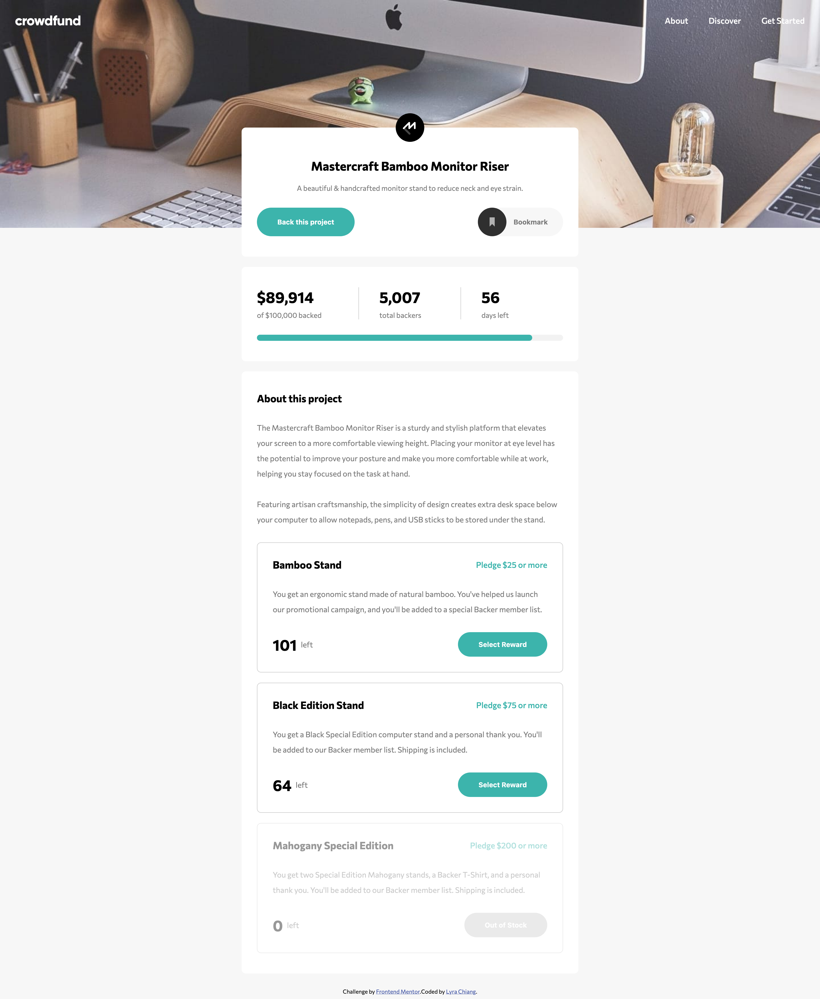
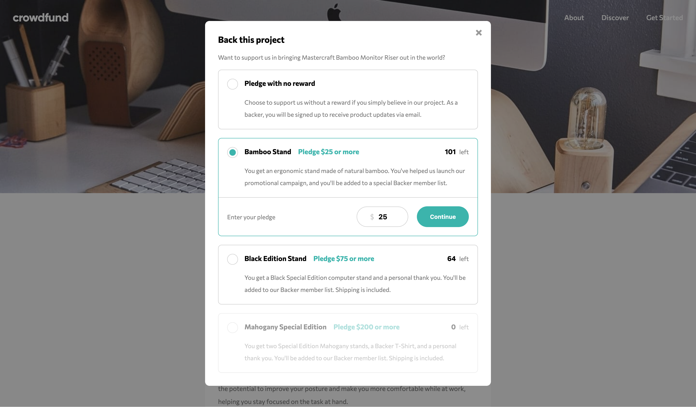
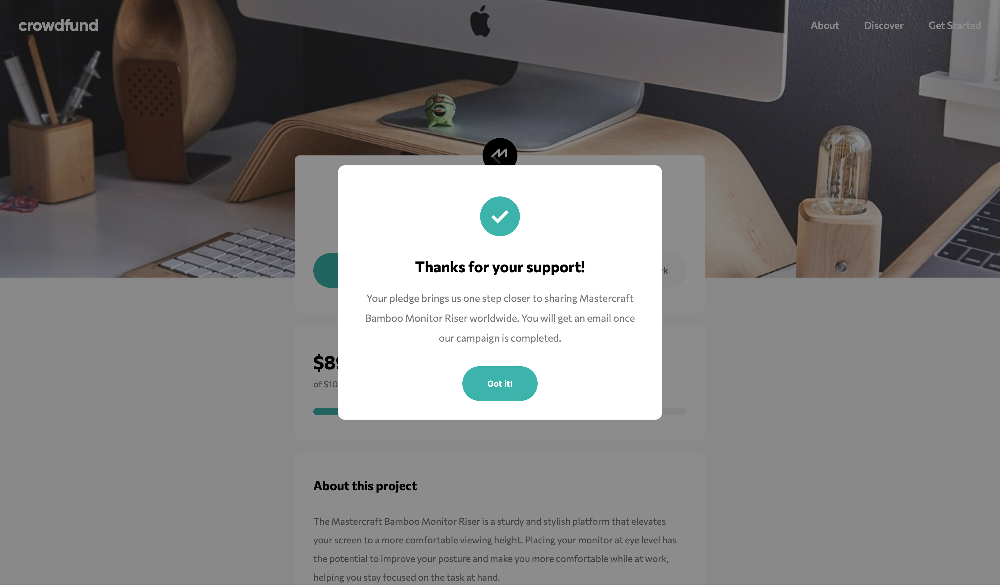
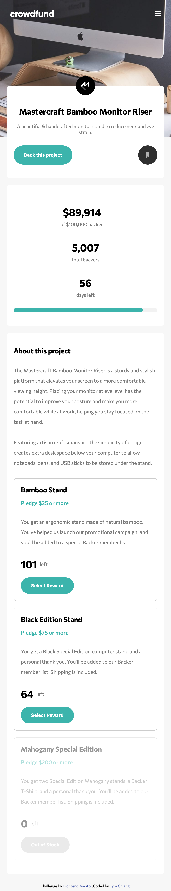
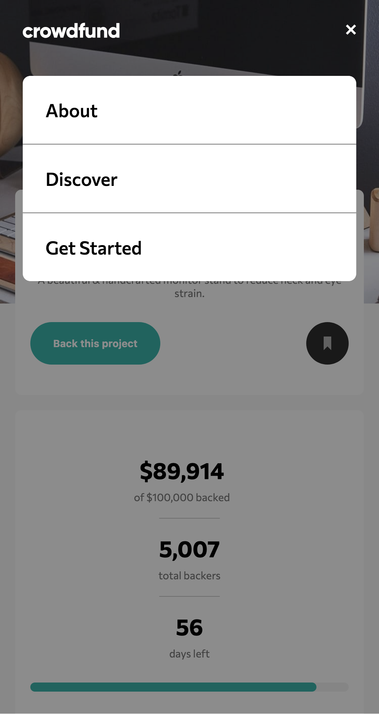
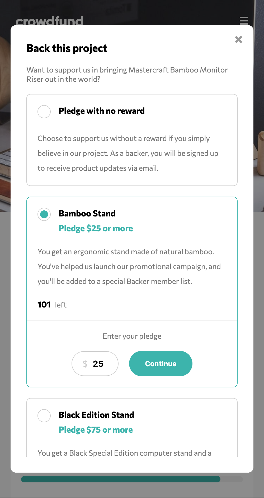
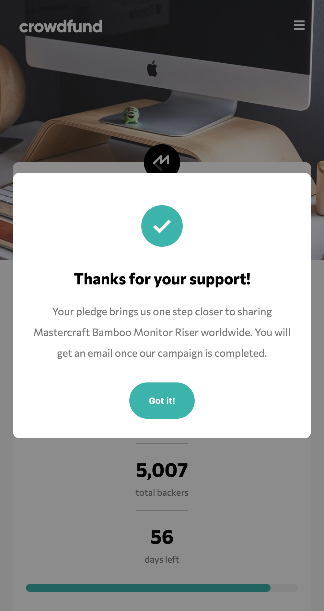

# Frontend Mentor - Crowdfunding product page solution

This is a solution to the [Crowdfunding product page challenge on Frontend Mentor](https://www.frontendmentor.io/challenges/crowdfunding-product-page-7uvcZe7ZR). Frontend Mentor challenges help you improve your coding skills by building realistic projects. 

## Table of contents

- [Overview](#overview)
  - [The challenge](#the-challenge)
  - [Screenshot](#screenshot)
  - [Links](#links)
- [My process](#my-process)
  - [Built with](#built-with)
- [Author](#author)
- [Acknowledgments](#acknowledgments)

## Overview

### The challenge

Users should be able to:

- View the optimal layout depending on their device's screen size
- See hover states for interactive elements
- Make a selection of which pledge to make
- See an updated progress bar and total money raised based on their pledge total after confirming a pledge
- See the number of total backers increment by one after confirming a pledge
- Toggle whether or not the product is bookmarked

### Screenshot

- Desktop

- Mobile

### Links

- Solution URL: [Solution](https://github.com/lyrachiang/frontend-mentor-challenges/tree/main/14-crowdfunding-product-page)
- Live Site URL: [Solution Demo](https://lyrachiang.github.io/frontend-mentor-challenges/14-crowdfunding-product-page/)

## My process

### Built with

- Semantic HTML5 markup
- CSS custom properties
- SCSS Modules
- Flexbox
- CSS Grid
- React
- Vite
- TypeScript

## Author

- Frontend Mentor - [@Lyra Chiang](https://www.frontendmentor.io/profile/lyrachiang)

## Acknowledgments

Thank you Frontend Mentor for the challenge!
